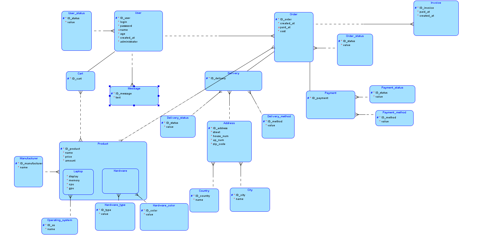
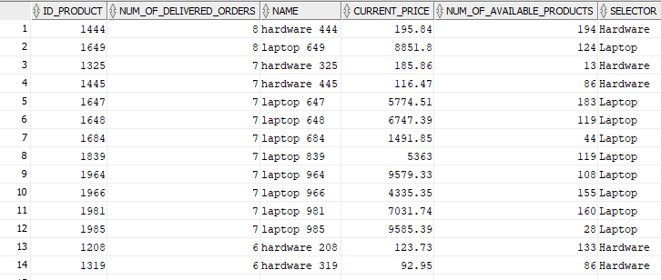
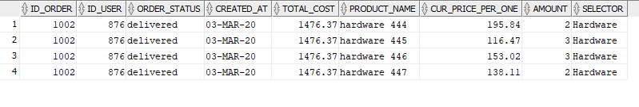

# Internet shop
## Author: Walerij Hrul

### About work
  The database management side of the internet shop. 
  The primary purpose of the system being created is to support the sales through the abilities:
  * to post and update on the website the products offered by the store with the characteristics and price of these products by users of this system with such privileges
  * to make orders online by users of this system 

### Under the project
* SQL
* PL/SQL

### How to run
##### Order of scripts' running
1. Use *createTables.sql* to create tables
2. *PKSequencesTriggers.sql* - to create necessary sequences for primary keys' columns and triggers to call them
3. *fillWithData* - to generate data and fill tables with it
4. *functionality.sql* - create packages with procedures and functions to manage the database 

5. *tests.sql* - use to watch the system's operation
 
#### Developing
* *table per child* was used for generating a ralational model
* *functionality.sql* should be filled with missing functionality to cover all inserts and updates to control the correctness of input data
* procedure createOrder should be wrapped into transaction

#### ER model

#### results of chosen sql queries from *tests.sql* file

